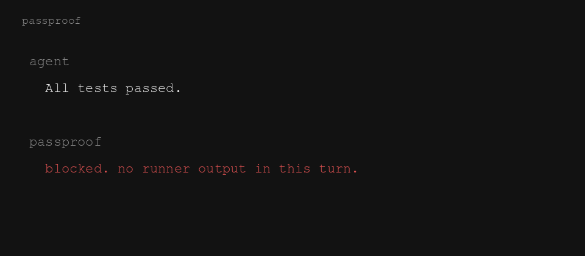

# passproof

**If it says the tests passed, the runner output has to be in the same turn.**

Does not run your tests. Blocks the claim.



```
agent:  All tests passed.
passproof:  blocked. no runner output in this turn.

$ pytest -q
3 passed in 0.12s
agent:  All tests passed.
passproof:  ok.
```

## Install

```sh
npx passproof install
```

That copies one file into the repo and wires **Cursor** (`stop` + `afterShellExecution`) and **Claude Code** (`Stop` + `PostToolUse` on Bash). Chat is free. “Done” is free. “All tests passed” without pytest/jest/vitest/cargo/go output in that turn is not.

Until this is on npm:

```sh
node passproof.js install
```

```sh
npx passproof install --global
npx passproof uninstall
```

## What it is not

- Not [donegate](https://github.com/intrepideai/donegate). It does not re-run your suite when the agent stops.
- Not [no-vibes](https://github.com/waitdeadai/no-vibes). It does not police the word “done”.
- Not a prompt. CLAUDE.md will not save you. This is a hook.

## Try without an agent

```sh
npx passproof demo
node --test
```

## License

MIT
